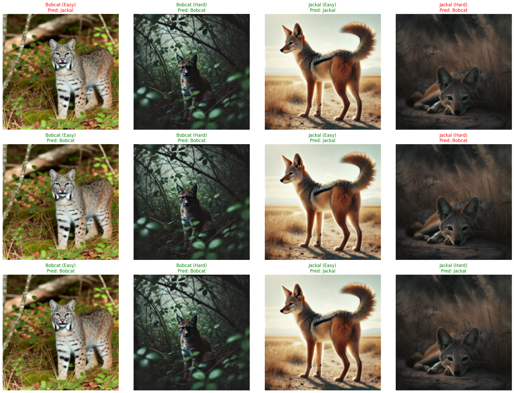

# VGG Custom Models: Training, Evaluation, and Visualization

## Overview 👀
This project showcases custom VGG models with varying configurations, ranging from a 1-block VGG to a 16-block VGG. The models are trained on images of Bobcats and Jackals, with TensorBoard utilized for visualizing training progress, model performance, and predictions.

## Features 🌟
- Custom VGG models with a configurable number of blocks.
- Robust training through data augmentation.
- Visualization of training metrics and predictions using TensorBoard.
- Logging of true and predicted labels in TensorBoard for easy analysis.

## Setup 🚀

### Prerequisites 📜
Ensure you have the following installed:
- Python 3.8+
- PyTorch
- torchvision
- TensorBoard

### Installation Steps 🤖
Clone the repository and install the required packages:
```bash
# Clone this repository 
git clone https://github.com/Renon133/ImageClassifier_ES335
cd ImageClassifier_ES335

# Install required packages
pip install -r requirements.txt
```

## Training the Models 🏆
To train a model with 1 block, run the following command:
```bash
Use train_and_evaluate() function to train the models 
```

### Available Models 🦅
- **VGG 1 Block**
- **VGG 3 Blocks**
- **VGG 16 Fine-Tuned (all layers)**
- **VGG 16 Fine-Tuned (last layer)**

## Visualizing with TensorBoard 🌄
Start TensorBoard to monitor training metrics and predictions:
```bash
tensorboard --logdir=runs
```
Navigate to [http://localhost:6006](http://localhost:6006) in your web browser to access the visualizations.

## Logging Test Set Predictions 🎞️
Log test set images along with true and predicted labels into TensorBoard by running:
```bash
python log_predictions.py --model vgg3 --test-set preprocessed/test
```
This displays a grid of images with true and predicted labels for easy verification.

### Example Usage 🏅
Below is a sample code snippet to visualize true and predicted labels for test set images:
```python
import torch
import matplotlib.pyplot as plt
from torch.utils.tensorboard import SummaryWriter
from torchvision.utils import make_grid

# Assuming model_vgg_3 is already trained
log_test_set_images_custom(model_vgg_3, test_loader, device)
```

## Results 🎯
| Model                | Training Time (s) | Training Loss | Training Accuracy (%) | Testing Accuracy (%) | Number of Parameters |
|----------------------|--------------------|---------------|------------------------|-----------------------|-----------------------|
| **VGG 1 Block**      | 49.77              | 0.000003      | 100.00                 | 96.67                 | 205,523,458           |
| **VGG 3 Blocks**     | 29.02              | 0.014031      | 99.58                  | 96.67                 | 12,921,474            |
| **VGG 3 Blocks Augmented** | 508.22        | 0.000081      | 100.00                 | 90.00                 | 12,921,474            |
| **VGG 16 FT All**    | 796.60             | 0.396785      | 89.54                  | 78.33                 | 134,268,738           |
| **VGG 16 FT Last**   | 282.50             | 0.000000      | 100.00                 | 98.33                 | 119,554,050           |

>## Insights and Discussion 🧐
>
>1. Are the results as expected? Why or why not?
>
>The results are mostly as expected. The VGG 16 Fine-Tuned (Last Layer) achieved the highest testing accuracy, which is expected since fine-tuning only the last layer helps retain useful pre-trained features while adapting to the new dataset. However, the VGG 3 Blocks Augmented model showed a drop in testing accuracy despite high training accuracy, indicating potential overfitting.
>
>2. Does data augmentation help? Why or why not?
>
>Data augmentation helps to improve the generalization of the model by providing variations of the training data. In this case, VGG 3 Blocks Augmented showed perfect training accuracy but a reduced testing accuracy compared to other models, suggesting that the model may still overfit despite augmentation. However, data augmentation can still be useful in reducing overfitting by exposing the model to more diverse examples.
>
>3. Does it matter how many epochs you fine-tune the model? Why or why not?
>
>Yes, the number of epochs for fine-tuning is crucial. Fine-tuning for too few epochs may result in underfitting, while too many epochs can lead to overfitting, especially if the learning rate is not adjusted appropriately. For example, VGG 16 FT All shows a lower accuracy compared to VGG 16 FT Last, which indicates that fine-tuning all layers might require a careful balance in terms of training time and hyperparameters.
>
>4. Are there any particular images that the model is confused about? Why or why not?
>
>There are indeed certain images that the model finds confusing, likely because the visual features of Bobcats and Jackals can be quite similar, such as fur patterns or background environments. This is evident from some misclassified images that TensorBoard logs, which often show visually ambiguous cases.
>
## Model Prediction Comparison Grid 🖼️

Below is the comparison grid of predictions made by the VGG 1 Block, VGG 3 Blocks, and VGG 16 FT models on 4 test images:


